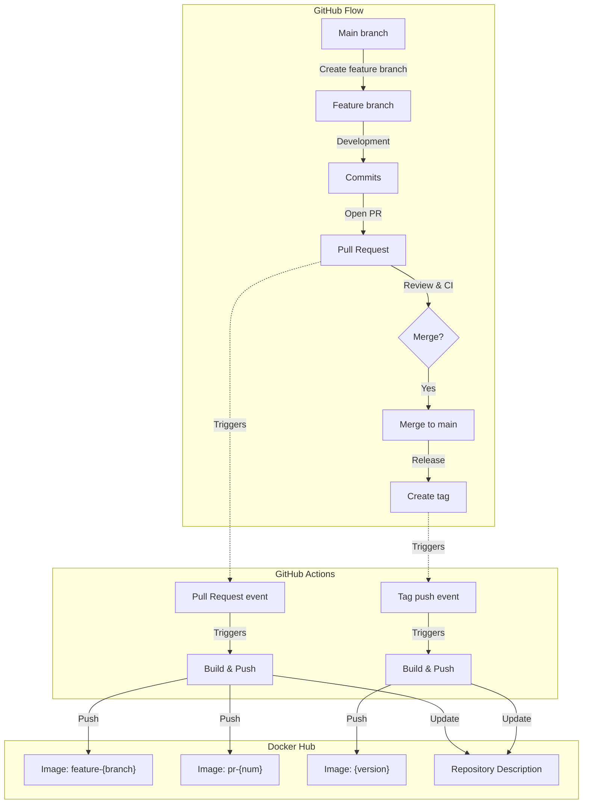
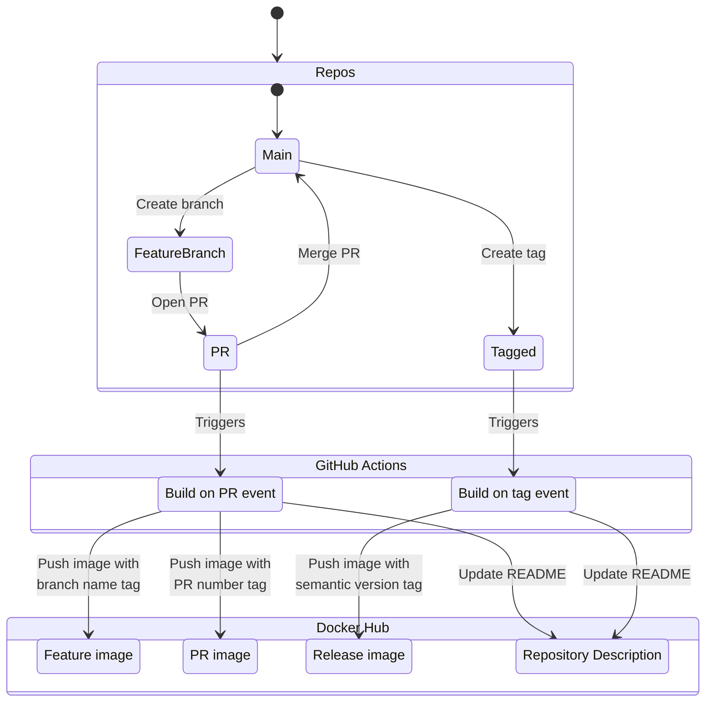
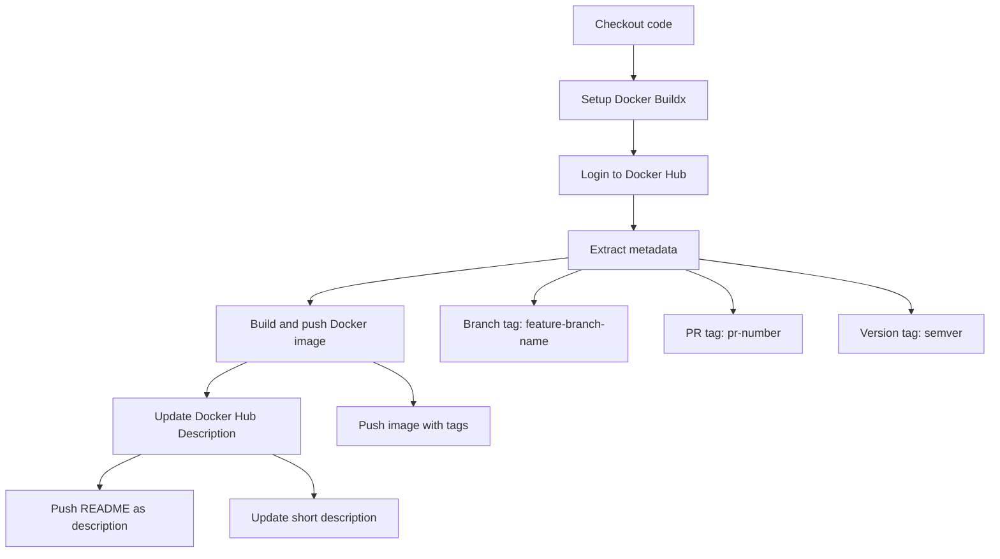

# Docker Image Lifecycle Management with GitHub Actions

## Overview

This document explains the GitHub Action workflow for Docker image lifecycle management that integrates with the GitHub Flow development process. The workflow automates building and publishing Docker images at different stages of the development cycle.

## Workflow Triggers

The workflow is triggered in two specific cases:

1. **Pull Requests**:
   - When a PR is opened against the `main` branch
   - When new commits are pushed to an existing PR

2. **Tags**:
   - When a tag is created on the repository (typically to mark a version)

## Workflow Steps

Each workflow execution follows these steps:

1. **Code Checkout**:
   - Retrieves the source code from the GitHub repository

2. **Docker Buildx Setup**:
   - Sets up an optimized Docker environment for building images

3. **Docker Hub Authentication**:
   - Logs in to Docker Hub with credentials stored in GitHub secrets

4. **Metadata Extraction**:
   - Automatically generates Docker tags based on context:
     - For branches: `feature-{branch-name}`
     - For PRs: `pr-{number}`
     - For tags: uses semantic versioning format

5. **Image Building and Publishing**:
   - Builds the Docker image based on the Dockerfile
   - Pushes the image to Docker Hub with appropriate tags

6. **Docker Hub Description Update**:
   - Transfers the README content as the full description of the Docker Hub repository
   - Sets a short description for the repository

## Tagging Strategy

The configuration uses the following tagging strategy:

1. **For feature branches**:
   - Tags in the format `feature-{branch-name}` (e.g., `feature-login`)

2. **For pull requests**:
   - Tags in the format `pr-{number}` (e.g., `pr-42`)

3. **For tagged versions**:
   - Tags in semantic versioning format (e.g., `v1.2.3`)

## GitHub Flow Integration

This configuration integrates perfectly with the GitHub Flow:

1. **Feature Development**:
   - Developers work on feature branches
   - With each push, a Docker image with the branch name is built and published
   - This allows for easy testing of the Docker image before approving the PR

2. **Code Review via PRs**:
   - When a PR is opened, a Docker image with the PR number is built
   - Reviewers can use this image to test the functionality

3. **Releases via Tags**:
   - Once a feature is merged, a tag can be created to mark a version
   - A Docker image with the version number is then built and published
   - This image represents a stable version of the product

## Benefits of this Approach

1. **Traceability**:
   - Each development stage is associated with a specific Docker image
   - Images are easily identifiable by their tag

2. **Testability**:
   - Docker images are available from the early stages of development
   - Ability to test features in isolation before merging

3. **Automated Documentation**:
   - Docker Hub description is kept up-to-date with the README
   - Documentation is centralized with the code

4. **Simplified Deployment**:
   - Version images (via tags) can be deployed to production
   - Feature images can be deployed to test environments

## Workflow Diagrams

### GitHub Flow with Docker Integration

### Workflow Trigger Diagram

### GitHub Actions Job Steps

This implementation represents a robust approach to managing the lifecycle of Docker images in an agile development context following the GitHub Flow.